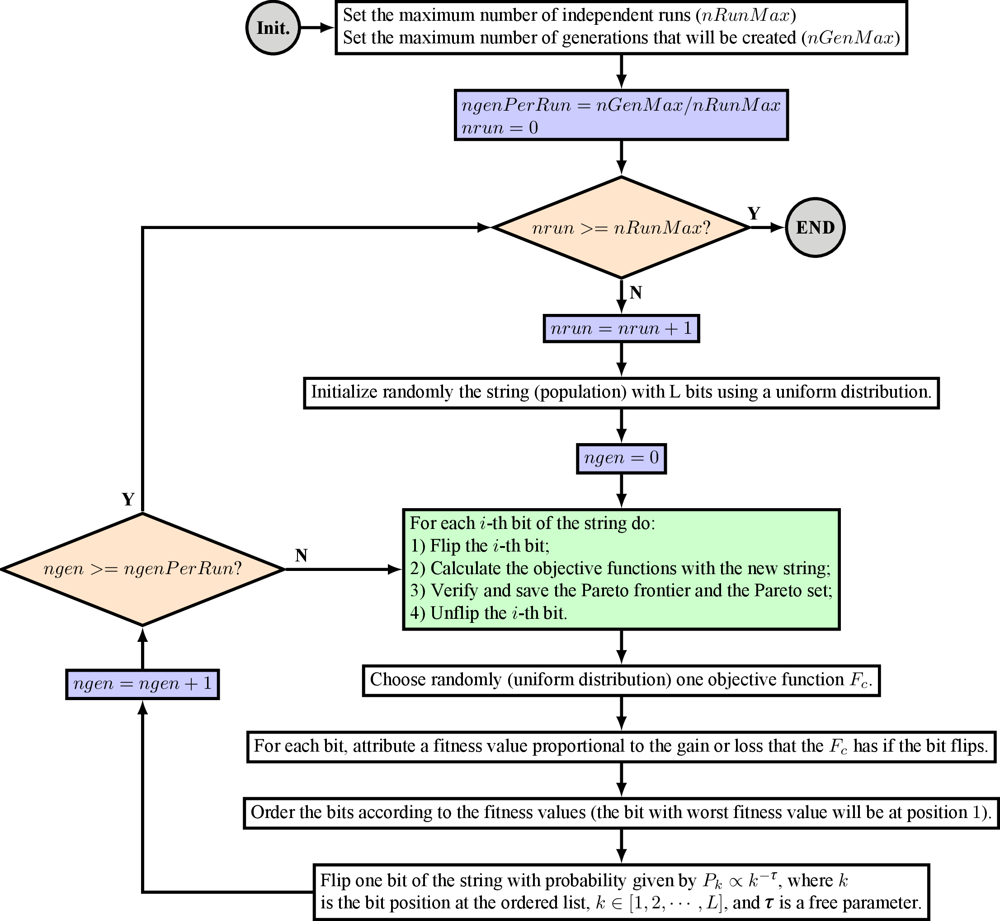

MGEO.jl - A Julia Library for MGEO
==================================

**MGEO.jl** is a Julia library that implements the Multiobjective Generalized
Extremal Optimization algorithm. It was coded by [Ronan Arraes Jardim
Chagas](http://www.ronanarraes.com) at [INPE](http://www.inpe.br)
(National Institute for Space Research, *in portuguese*).

The code was based on [**MGEOCpp**](https://github.com/ronisbr/mgeocpp)

MGEO
----

GEO is an evolutionary algorithm developed at [INPE](http://www.inpe.br) [1]
that, along with its multiobjective version (M-GEO), has already been
successfully applied to a myriad of optimization engineering problems:

* Thermal design [2];
* Structural optimization [3];
* Satellite layout design [4];
* Spacecraft attitude controller for a rigid-flexible satellite [5];
* Design satellite constellations that minimize the average and the maximum
  revisit time over a region of interest [6];
* Given an analysis interval and a region of interest, design satellite
  constellations that minimize the number of spacecraft, the mean orbital
  altitude, and the area not accessible [7].

The flowchart of MGEO is [7]:



The library **MGEOjulia** codes in Julia the algorithm presented in the MGEO
flowchart.

Usage
-----

The minimal working code for **MGEO.jl** is:

```julia
using MGEO

designVars      = conf_design_vars({list_of_bits}, {list_of_minimum_values}, {list_of_maximum_values}, {list_of_names})
mgeod           = conf_mgeo(Nf, tau, ngen_max, run_max, design_vars)
pareto_frontier = mgeo_run(mgeoData, f_obj)
pf_to_csv(pareto_frontier, "output.csv", design_vars)
```
where

| Parameter                              | Description                                               | Type                                   | Example                                 |
| -------------------------------------- | --------------------------------------------------------- |:--------------------------------------:|:---------------------------------------:|
| `Nf`                                   | Number of objective functions.                            | `Int64`                                | 2                                       |
| `tau`                                  | Parameter to set the determinism of the search.           | `Float64`                              | 3.0                                     |
| `ngen_max`                             | Maximum number of generations that will be created.       | `Int64`                                | 30000                                   |
| `runMax`                               | Maximum number of independent runs.                       | `Int64`                                | 50                                      |
| `list_of_bits`                         | Number of bits for each design variable.                  | `Vector{Int64}`                        | [8, 8]                                  |
| `list_of_minimum_values`               | Minimum values for each design variable.                  | `Vector{T<:Number}`                    | [-10.0, -5.0]                           |
| `list_of_maximum_values`               | Maximum values for each design variable.                  | `Vector{T<:Number}`                    | [5.0, 2.0]                              |
| `list_of_names`                        | List with the design variable names (OPTIONAL).           | `Vector{Strings}`                      | ["Variable 1", "Variable 2"]            |

and `f_obj` must be a user-defined function that receives the design variables
and computes the objective functions. It must be defined as follows:

```
function f_obj(vars)

    1) Read the design variables vars[1], vars[2], vars[3], ..., vars[N]
    2) Compute the objective functions f[1], f[2], f[3], ..., f[nf]
    3) Return (valid, f), where variable valid is false if the objective
       function evaluation was not performed correctly or true otherwise.

end
```

Julia version
-------------

The package is tested against Julia **v0.7**.

License
-------

This project is released under the **BSD 3-Clause License** (see
[LICENSE.md](./LICENSE.md) file).

Authors
-------

[Ronan Arraes Jardim Chagas](http://www.inpe.br/ete/dse/ronan) created MGEOjulia.

References
----------

[1] F. L. de Sousa, F. M. Ramos, P. Paglione, and R. M. Girardi, "**New
stochastic algorithm for design optimization**," *AIAA Journal*, vol. 41, no. 9,
pp. 1808-1818, 2003.

[2] A. P. C. Cuco, F. L. de Sousa, V. V. Vlassov, and A. J. da Silva Neto,
"**Multi-objective design optimization of a new space radiator**," *Optimization
and Engineering*, vol. 12, no. 3, pp. 393-406, 2011.

[3] F. L. de Sousa and W. K. Takahashi, **Generalized extremal optimization
applied to three-dimensional truss design**," in *18th Internation Congress of
Mechanical Enginering*. Ouro Preto, MG, Brazil: Associação Brasileira de
Engenharia e Ciências Mecânicas, 2005.

[4] A. P. C. Cuco, F. L. de Sousa, and A. J. S. Neto, "**A multi-objective
methodology for spacecraft equipment layouts**," *Optimization and Engineering
(Online)*, 2014.

[5] I. Mainenti-Lopes, L. C. G. Souza, and F. L. de Sousa, "**Design of a
nonlinear controller for a rigid-flexible satellite using multi-objective
generalized extremal optimization with real codification**," *Shock and
Vibration*, vol. 19, pp. 947-956, 2012.

[6] R. L. Galski, F. L. de Sousa, and F. M. Ramos, "**Application of a new
multiobjective evolutionary algorithm to the optimum design of a remote sensing
satellite constellation**," in *5th International Conference of Inverse Problems
in Engineering: Theory and Practice*, Cambridge, UK, 2005.

[7] R. A. J. Chagas, R. L. Galski, F. L. de Sousa, "**OrbGEO - An Orbit
Selection Tool for Satellite Constellations Using the Multiobjective Generalized
Extremal Optimization (MGEO) Algorithm**", in *6th International Conference on
Systems & Concurrent Engineering for Space Applications*, Stuttgart, Germany,
2014.
